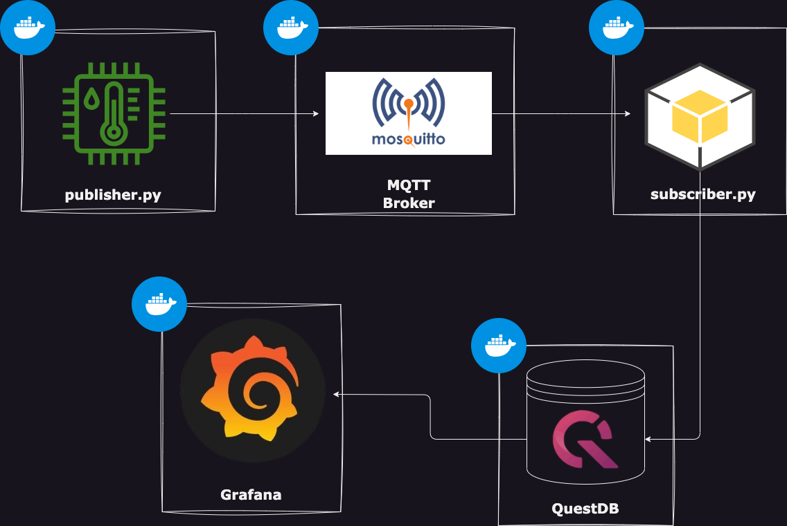

# MQTT_Service

[MQTT_Service]



## Description

[MQTT_Service] is a Python-based project that simulates a fake producer of temperature and humidity data using MQTT (Message Queuing Telemetry Transport). The project consists of several components, including a MQTT Python client producer, a MQTT broker (Mosquitto), a MQTT Python client consumer, QuestDB, and Grafana. The objective of this project is to generate temperature and humidity data, consume it using the client consumer, and store the data in QuestDB for further analysis and visualization using Grafana. 

## Table of Contents

- [Installation](#installation)
- [MQTT Python Client Producer](#mqtt-python-client-producer)
- [MQTT Broker (Mosquitto)](#mqtt-broker-mosquitto)
- [MQTT Python Client Consumer](#mqtt-python-client-consumer)
- [QuestDB](#questdb)
- [Grafana](#grafana)


## Installation 

- Clone the repo:

    ```bash
        git clone https://github.com/nikosrk/MQTT_Service.git
    ```

- Start running the services:

> Configure Mosquitto Broker
    
    ```bash
        cd MQTT_Service
        docker-compose up -d 
    ```

> Start Mosquitto Broker, Quest, Grafana service

    ```bash
        cd MQTT_Service
        docker create network mqtt_services_network
        docker-compose up -d 
    ```

> Start Fake Weather Publisher service

    ```bash
        cd mqtt_publisher_service
        docker create network mqtt_network_1
        docker build -t mqtt_publisher_1 .
        docker-compose up -d
    ```

> Start Subscriber (Consumer) service

    ```bash
        cd mqtt_subscriber_service
        docker create network mqtt_network_2
        docker build -t mqtt_subscriber_1 .
        docker-compose up -d
    ```


## MQTT Python Client Producer

The MQTT Python Client Producer component is responsible for generating fake temperature, humidity data and timestamp (in unix epoch -> specifically in nanoseconds). It uses the MQTT protocol to publish the data to the MQTT broker. You can find the code for the client producer in the publisher.py file. 

## MQTT Broker (Mosquitto)

The MQTT Broker (Mosquitto) acts as the message broker for the MQTT communication. It handles the incoming messages from the MQTT Python Client Producer and forwards them to the MQTT Python Client Consumer. 

## MQTT Python Client Consumer

The MQTT Python Client Consumer component subscribes to the MQTT broker and consumes the temperature, humidity, timestamp generated by the MQTT Python Client Producer. It saves the data to QuestDB for further analysis. You can find the code for the client consumer in the subscriber.py file. 


## QuestDB

QuestDB is the time-series database used in this project to store the aforementioned data. It provides fast and efficient storage for time-series data and supports various querying and analytical capabilities.

## Grafana

Grafana is used as the visualization tool in this project. It connects to QuestDB to fetch and display the stored temperature and humidity data in visually appealing dashboards and charts. To query the data i used the PostgreSQL wire protocol.
To use Grafana:
- Open Toggle Menu -> Go to Connections -> data sources -> add new data source -> select PostgreSQL -> in Settings: 1) Host: questdb:8812, 2) weather_data, 3) (Default) User: admin, Password: quest, 4)  TLS/SSL Mode: disable -> Save & Test
- Open Toggle Menu -> Go to Dashboards -> click New -> New Dashboards -> Add Visualization -> Select data source (PostgreSQL) ->
    > instead of Builder, select Code and add query: 
        ```sql 
            SELECT timestamp AS TIME, temperature FROM weather_data
        ```
    > Run query
    > Select the +Query
        ```sql 
            SELECT timestamp AS TIME, humidity FROM weather_data
        ```